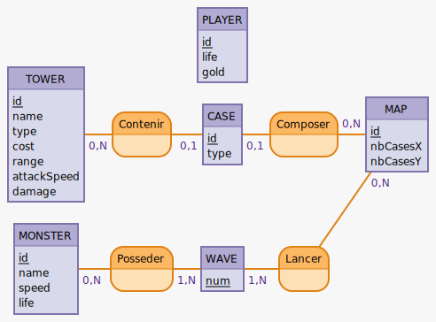

# Tower Defense

## Listing des fonctionnalités

### Etape 1

- [ ] Faire une grille dynamique
- [ ] Ajouter dynamiquement une route pour les monstres
- [ ] Faire déplacer un carré sur cette route
- [ ] Ajouter des cases pour pouvoir placer les tourelles
- [ ] Ajouter l'event pour acheter une tourelle et la placer
- [ ] Tir de la tourelle (dans une zone)
- [ ] Collision tir-monstre => event
- [ ] Coin pour les infos du joueurs (PV - PO)

## Objets

### Joueur

- [ ] Nombre de vies
- [ ] Or

### Tour
- [ ] Type de tour
- [ ] Cout
- [ ] Range
- [ ] Vitesse de tir
- [ ] Dégâts

### Map
- [ ] Cases

### Case
- [ ] Type de cases

## Modèle Conceptuel de Données

http://mocodo.wingi.net/

Code :
```
PLAYER: id, life, gold

TOWER: id, name, type, cost, range, attackSpeed, damage
Contenir, 0N TOWER, 01 CASE
CASE: id, type
Composer, 0N MAP, 01 CASE
MAP: id, nbCasesX, nbCasesY

MONSTER: id, name, speed, life
Posseder, 1N WAVE, 0N MONSTER
WAVE: num, gain, desc
Lancer, 1N WAVE, 0N MAP
```


